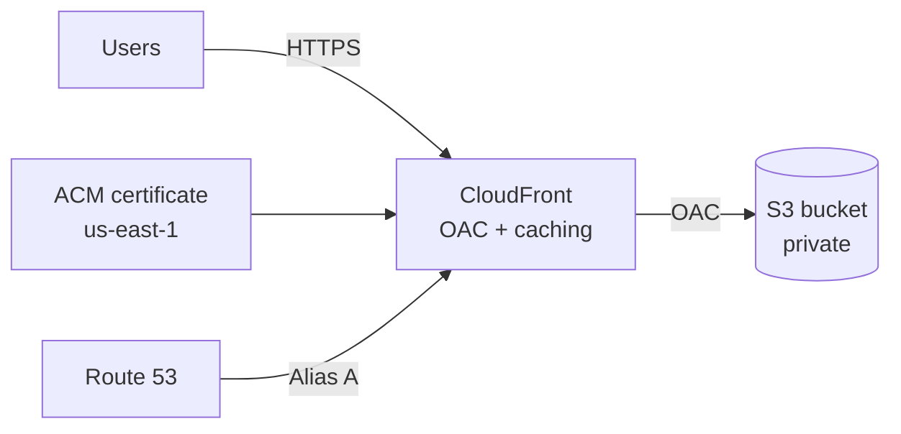

# AWS Secure Static Website (Terraform)


Secure AWS hosting for static build artifacts (React, Vite, Next.js export, etc.) using CloudFront with a private S3 origin. DNS via Route 53, TLS via ACM (us-east-1). Includes an evidence pack with screenshots that show the whole setup in action.

---

## What this covers

**Platform side:** CloudFront + S3 + Route 53 + ACM wired together end-to-end. Remote Terraform state in S3 with optional DynamoDB locking. The module is reusable — you can drop it into other projects and just change the variables.

**Security side:** The S3 bucket stays private (no public website hosting enabled). CloudFront is the only thing allowed to read from it, using Origin Access Control (OAC). HTTPS-only with a modern TLS policy. Terraform doesn't run under admin — it uses a dedicated SSO role with scoped permissions. Everything gets logged in CloudTrail.

---

## Architecture



The key point: S3 stays completely private. CloudFront is the only reader, and users only ever hit CloudFront over HTTPS.

---

## Repo structure

```
.github/workflows/terraform-ci.yml   # CI: fmt, init, validate
infra/
  modules/static_site/               # Reusable Terraform module
  envs/prod/                         # Prod environment + backend config
  docs/evidence/                     # Screenshots
README.md
```

---

## Prerequisites

- Terraform >= 1.6, AWS provider >= 5.x
- A Route 53 hosted zone for your domain
- An S3 bucket for Terraform state (DynamoDB lock table is optional but recommended)
- AWS credentials configured locally (SSO/Identity Center recommended)

---

## Configuration

Defaults live in `infra/envs/prod/variables.tf`. Override with `-var` or a `*.tfvars` file:

| Variable                | What it does                                         | Example             |
| ----------------------- | ---------------------------------------------------- | ------------------- |
| `domain_name`           | Your website domain                                  | `example.com`       |
| `hosted_zone_name`      | The Route 53 hosted zone                             | `example.com`       |
| `bucket_name`           | S3 bucket for the static files                       | `example.com`       |
| `enable_acm_validation` | Terraform creates the DNS validation records for ACM | `true`              |
| `web_acl_id`            | Optional WAFv2 WebACL ARN                            | `arn:aws:wafv2:...` |

If you set `enable_acm_validation = true`, Terraform handles the certificate validation automatically by creating the required Route 53 records. For WAF, the WebACL needs to be scoped to CLOUDFRONT and created in us-east-1.

---

## Deploy

**PowerShell (Windows):**

```powershell
aws sso login --profile <profile>
$env:AWS_PROFILE = "<profile>"
$env:AWS_SDK_LOAD_CONFIG = "1"

cd infra/envs/prod
terraform init
terraform plan -out plan.out
terraform apply plan.out
```

**Bash (Linux/macOS):**

```bash
aws sso login --profile <profile>
export AWS_PROFILE="<profile>"

cd infra/envs/prod
terraform init
terraform plan -out plan.out
terraform apply plan.out
```

After apply you get `cloudfront_domain` (the CloudFront URL) and `bucket_name` (where to upload your files).

---

## Upload your site

Basic:

```bash
npm run build
aws s3 sync ./build s3://<bucket>/ --delete
```

With proper caching (recommended for production):

```bash
# Assets get cached for a year
aws s3 sync ./build s3://<bucket>/ --delete \
  --exclude "index.html" \
  --cache-control "public,max-age=31536000,immutable"

# index.html gets a short cache so updates are visible quickly
aws s3 cp ./build/index.html s3://<bucket>/index.html \
  --cache-control "public,max-age=60"
```

If you need changes to show up immediately:

```bash
aws cloudfront create-invalidation --distribution-id <id> --paths "/*"
```

---

## Security summary

| What                  | How                                      |
| --------------------- | ---------------------------------------- |
| S3 access             | Private bucket, CloudFront reads via OAC |
| Transport             | HTTPS-only, TLS 1.2+                     |
| Terraform permissions | Scoped SSO role, no admin access         |
| Audit                 | CloudTrail logs all API activity         |

---

## Evidence

All screenshots are in `infra/docs/evidence/`. They follow the chain: identity → permissions → Terraform → audit trail → deployed resources.

> ⚠️ If you fork this repo, redact your account IDs, hosted zone IDs, IPs, and email addresses before making it public.

---

### CLI identity

This shows the output of `aws sts get-caller-identity` in PowerShell. The important part is the ARN — it shows the session is running under `AWSReservedSSO_TerraformDeployer`, which is the dedicated SSO role for deployments. Not an admin role, not long-lived IAM user credentials. Short-lived session tokens from SSO.


---

### IAM Identity Center assignments

The Identity Center console showing which permission sets are assigned to the AWS account. You can see TerraformDeployer (for infra), WebsiteDeployer (for uploading content), and AdministratorAccess (for when you actually need admin). This setup means day-to-day work doesn't require admin permissions — each task gets the minimum access it needs.


---

### TerraformDeployer permission set

The permission set configuration page for TerraformDeployer. Shows the session duration and that it's properly provisioned. This is a managed, reusable permission set in Identity Center — not a random IAM user someone created and forgot about.


---

### TerraformDeployer inline policy

This is the actual IAM policy JSON attached to TerraformDeployer. It grants access to S3 (for the state bucket and site bucket), DynamoDB (for the state lock table), Route 53 (for DNS records), CloudFront (for the distribution), and ACM (for the certificate). No `"*"` actions, no admin wildcards — just the specific permissions Terraform needs to manage this stack.


---

### Terraform plan

The output of `terraform plan` showing "No changes. Your infrastructure matches the configuration." This confirms the AWS environment is in sync with the Terraform code. No drift, no surprises. You can run plan repeatedly and it stays stable.


---

### CloudTrail: SSO session

A CloudTrail event showing `AssumeRoleWithSAML` — this is the API call that happens when you authenticate via SSO and assume the TerraformDeployer role. The event includes timestamp, the role ARN, and request metadata. Every session is logged and traceable.


---

### CloudTrail: Terraform activity

CloudTrail event history filtered to show CloudFront API calls. You can see things like `GetDistribution`, `ListTagsForResource` — the calls Terraform makes to read and manage the infrastructure. All of this is tied back to the TerraformDeployer session. If something changes, you can trace exactly who did it and when.


---

### S3 buckets

The S3 console showing both buckets: one for the website content (the domain name) and one for Terraform state (`tfstate-...`). They're separate on purpose — you don't want your IaC state mixed with your application files. Different lifecycles, different access patterns.


---

### CloudFront distribution

The CloudFront distribution in the console. Status is deployed and enabled, custom domains are configured (root + www), and the origin is the private S3 bucket. This is the CDN that actually serves traffic to users.


---

### ACM certificate

The ACM certificate in us-east-1 (CloudFront requires certificates to be in us-east-1, even if your other resources are elsewhere). Status is "Issued", covers both the root domain and www. This is what enables HTTPS on the CloudFront distribution.


---

### Route 53 records

The Route 53 hosted zone with the DNS records. A and AAAA alias records for both root and www, pointing to the CloudFront distribution. This completes the chain: someone types your domain → Route 53 resolves it to CloudFront → CloudFront serves the content from S3.


---

## CI

The workflow in `.github/workflows/terraform-ci.yml` runs on every push and PR:

- `terraform fmt -check -recursive` — catches formatting issues
- `terraform init -backend=false` — initializes without touching remote state
- `terraform validate` — checks the config is syntactically valid

No secrets needed, no AWS access required. Just syntax and format checks.

---

## Roadmap

- [ ] CloudFront/S3 access logging + Athena for queries
- [ ] WAF baseline rules (rate limiting, AWS managed rules)
- [ ] Budget alerts
- [ ] Security scanning in CI (tflint, tfsec, checkov)
- [ ] `terraform.tfvars.example` for easier onboarding
