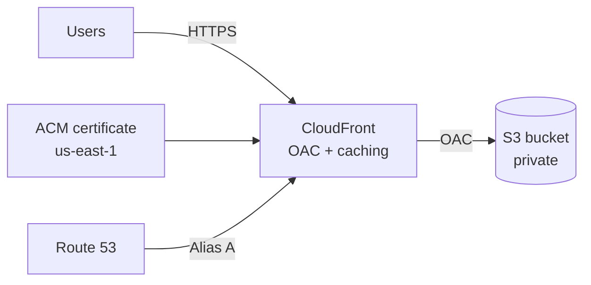

# AWS Secure Static Website (Terraform)


Terraform setup for hosting static sites (React, Vite, Next.js builds, whatever) on AWS. CloudFront in front, private S3 bucket behind it, Route 53 for DNS, ACM for the certificate. The repo includes screenshots showing everything actually works.

## What this covers

CloudFront + S3 + Route 53 + ACM wired together. Remote Terraform state in S3 with optional DynamoDB locking. The module is reusable, just swap out the variables for a different domain.

On the security side: S3 bucket is private (no public website hosting), CloudFront reads via OAC, HTTPS only, and Terraform runs under a scoped SSO role instead of admin. CloudTrail logs everything.

## Architecture



S3 stays private. CloudFront is the only thing that reads from it.

## Repo structure

```
.github/workflows/terraform-ci.yml   # fmt, init, validate
infra/
  modules/static_site/               # the module
  envs/prod/                         # prod config + backend
  docs/evidence/                     # screenshots
README.md
```

## Prerequisites

Terraform >= 1.6, AWS provider >= 5.x, a Route 53 hosted zone, an S3 bucket for state (DynamoDB lock optional), and AWS credentials configured (SSO recommended).

## Configuration

Defaults are in `infra/envs/prod/variables.tf`. Override with `-var` or a tfvars file.

| Variable                | What it does                             | Example             |
| ----------------------- | ---------------------------------------- | ------------------- |
| `domain_name`           | your domain                              | `example.com`       |
| `hosted_zone_name`      | Route 53 zone                            | `example.com`       |
| `bucket_name`           | S3 bucket for files                      | `example.com`       |
| `enable_acm_validation` | Terraform creates DNS validation records | `true`              |
| `web_acl_id`            | WAFv2 WebACL ARN (optional)              | `arn:aws:wafv2:...` |

With `enable_acm_validation = true` Terraform handles certificate validation automatically. WAF needs to be CLOUDFRONT scoped in us-east-1.

## Deploy

PowerShell:

```powershell
aws sso login --profile <profile>
$env:AWS_PROFILE = "<profile>"
$env:AWS_SDK_LOAD_CONFIG = "1"

cd infra/envs/prod
terraform init
terraform plan -out plan.out
terraform apply plan.out
```

Bash:

```bash
aws sso login --profile <profile>
export AWS_PROFILE="<profile>"

cd infra/envs/prod
terraform init
terraform plan -out plan.out
terraform apply plan.out
```

Outputs are `cloudfront_domain` and `bucket_name`.

## Upload your site

```bash
npm run build
aws s3 sync ./build s3://<bucket>/ --delete
```

Better caching setup:

```bash
aws s3 sync ./build s3://<bucket>/ --delete \
  --exclude "index.html" \
  --cache-control "public,max-age=31536000,immutable"

aws s3 cp ./build/index.html s3://<bucket>/index.html \
  --cache-control "public,max-age=60"
```

Invalidate if needed:

```bash
aws cloudfront create-invalidation --distribution-id <id> --paths "/*"
```

## Security

S3 is private, CloudFront reads via OAC. HTTPS only with TLS 1.2+. Terraform uses a scoped SSO role, not admin. CloudTrail logs all API calls.

## Evidence

Screenshots in `infra/docs/evidence/`. They go through: identity → permissions → Terraform → audit logs → deployed resources.

If you fork this, redact account IDs, hosted zone IDs, IPs, and emails before sharing publicly.

### CLI identity

Output of `aws sts get-caller-identity` showing the session runs under `AWSReservedSSO_TerraformDeployer`. Not admin, not long-lived IAM keys, just a scoped SSO role with short-lived tokens.


### IAM Identity Center assignments

Identity Center console with the permission sets: TerraformDeployer for infra work, WebsiteDeployer for uploading content, AdministratorAccess for when you actually need it. Day-to-day stuff doesn't touch admin.


### TerraformDeployer permission set

The permission set config showing session duration and provisioning status. Managed in Identity Center, not some random IAM user.


### TerraformDeployer inline policy

The actual IAM policy. S3 for state and site buckets, DynamoDB for the lock table, Route 53, CloudFront, ACM. No wildcards, just what Terraform needs for this stack.


### Terraform plan

`terraform plan` output with "No changes. Your infrastructure matches the configuration." AWS matches the code, no drift.


### CloudTrail SSO session

CloudTrail event for `AssumeRoleWithSAML` when the SSO session was created. Timestamp, role ARN, everything logged.


### CloudTrail Terraform activity

CloudTrail showing CloudFront API calls like `GetDistribution`, `ListTagsForResource`. All tied to the TerraformDeployer session. You can trace who did what and when.


### S3 buckets

Two buckets: one for website content, one for Terraform state. Separate on purpose, different lifecycles.


### CloudFront distribution

Distribution is deployed, custom domains configured, S3 origin set up. This is what serves the traffic.


### ACM certificate

Certificate in us-east-1 (CloudFront requirement), issued, covers root and www.


### Route 53 records

A/AAAA alias records for root and www pointing to CloudFront. Domain → Route 53 → CloudFront → S3.


## CI

`.github/workflows/terraform-ci.yml` runs on push and PR:

- `terraform fmt -check -recursive`
- `terraform init -backend=false`
- `terraform validate`

No AWS credentials needed, just syntax checks.

## Roadmap

- [ ] Access logging + Athena
- [ ] WAF rules
- [ ] Budget alerts
- [ ] tflint/tfsec/checkov in CI
- [ ] terraform.tfvars.example
