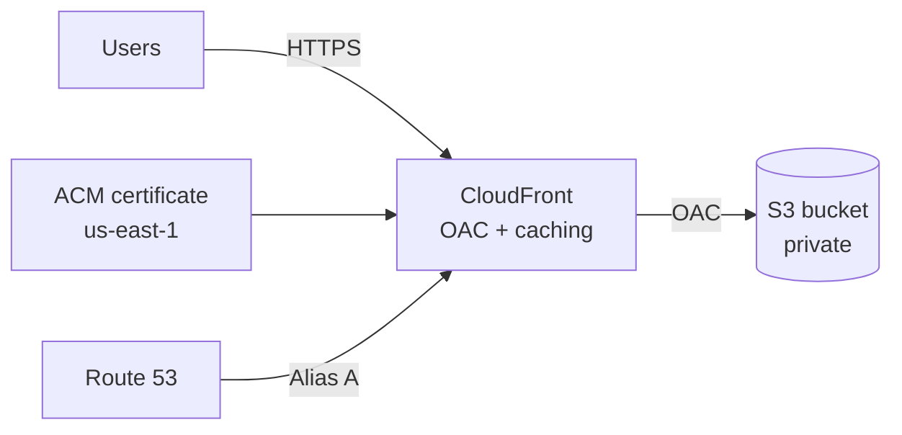

# AWS Secure Static Website (Terraform)


Secure AWS hosting for static build artifacts (React, Vite, Next.js export, etc.) using CloudFront with a private S3 origin. DNS is managed in Route 53, TLS comes from ACM (us-east-1). An evidence pack of screenshots shows the setup end to end: identity, permissions, Terraform idempotency, audit logging, and deployed resources.

---

## What this covers

**Platform side:** CloudFront + S3 + Route 53 + ACM wired together end-to-end. Remote Terraform state in S3 with optional DynamoDB locking. The module is reusable; drop it into other projects and just change the variables.

**Security side:** The S3 bucket stays private (no public website hosting). CloudFront is the only reader via Origin Access Control (OAC). HTTPS-only with a modern TLS policy. Terraform runs under a dedicated SSO role with scoped permissions. Everything is logged in CloudTrail.

---

## Architecture



The key point: S3 stays private. CloudFront is the only reader, and users only ever hit CloudFront over HTTPS.

---

## Repo structure

```
.github/workflows/terraform-ci.yml   # CI: fmt, init, validate
infra/
  modules/static_site/               # Reusable Terraform module
  envs/prod/                         # Prod environment + backend config
  docs/evidence/                     # Screenshots
README.md
```

---

## Prerequisites

- Terraform >= 1.6, AWS provider >= 5.x
- A Route 53 hosted zone for your domain
- An S3 bucket for Terraform state (DynamoDB lock table optional)
- AWS credentials configured locally (SSO/Identity Center recommended)

---

## Configuration

Defaults live in `infra/envs/prod/variables.tf`. Override with `-var` or a `*.tfvars` file:

| Variable                | What it does                                         | Example             |
| ----------------------- | ---------------------------------------------------- | ------------------- |
| `domain_name`           | Your website domain                                  | `example.com`       |
| `hosted_zone_name`      | The Route 53 hosted zone                             | `example.com`       |
| `bucket_name`           | S3 bucket for the static files                       | `example.com`       |
| `enable_acm_validation` | Terraform creates the DNS validation records for ACM | `true`              |
| `web_acl_id`            | Optional WAFv2 WebACL ARN                            | `arn:aws:wafv2:...` |

If you set `enable_acm_validation = true`, Terraform handles certificate validation automatically by creating the required Route 53 records. For WAF, the WebACL needs to be scoped to CLOUDFRONT and created in us-east-1.

---

## Deploy

**PowerShell (Windows):**

```powershell
aws sso login --profile <profile>
$env:AWS_PROFILE = "<profile>"
$env:AWS_SDK_LOAD_CONFIG = "1"

cd infra/envs/prod
terraform init
terraform plan -out plan.out
terraform apply plan.out
```

**Bash (Linux/macOS):**

```bash
aws sso login --profile <profile>
export AWS_PROFILE="<profile>"

cd infra/envs/prod
terraform init
terraform plan -out plan.out
terraform apply plan.out
```

After apply you get `cloudfront_domain` (the CloudFront URL) and `bucket_name` (where to upload your files).

---

## Upload your site

Basic:

```bash
npm run build
aws s3 sync ./build s3://<bucket>/ --delete
```

With proper caching (recommended for production):

```bash
# Assets get cached for a year
aws s3 sync ./build s3://<bucket>/ --delete \
  --exclude "index.html" \
  --cache-control "public,max-age=31536000,immutable"

# index.html gets a short cache so updates are visible quickly
aws s3 cp ./build/index.html s3://<bucket>/index.html \
  --cache-control "public,max-age=60"
```

If you need changes to show up immediately:

```bash
aws cloudfront create-invalidation --distribution-id <id> --paths "/*"
```

---

## Security summary

| What                  | How                                      |
| --------------------- | ---------------------------------------- |
| S3 access             | Private bucket, CloudFront reads via OAC |
| Transport             | HTTPS-only, TLS 1.2+                     |
| Terraform permissions | Scoped SSO role, no admin access         |
| Audit                 | CloudTrail logs all API activity         |

---

## Evidence

All screenshots are in `infra/docs/evidence/`. They follow the chain: identity -> permissions -> Terraform -> audit trail -> deployed resources.

> If you fork this repo, redact your account IDs, hosted zone IDs, IPs, and email addresses before making it public.

### CLI identity
`aws sts get-caller-identity` in PowerShell shows the session running under `AWSReservedSSO_TerraformDeployer`. Short-lived SSO tokens, not admin keys.  


### IAM Identity Center assignments
Account assignments and permission sets (TerraformDeployer, WebsiteDeployer, AdministratorAccess); day-to-day work uses scoped roles, not admin.  


### TerraformDeployer permission set
Configuration view with session duration; managed, reusable deploy role in Identity Center.  


### TerraformDeployer inline policy
Scoped IAM policy JSON for S3 (state + site), DynamoDB (lock), Route 53, CloudFront, ACM. No wildcards.  


### Terraform plan
`terraform plan` ends with “No changes. Your infrastructure matches the configuration.” Confirms no drift.  


### CloudTrail: SSO session
`AssumeRoleWithSAML` event with timestamp and role ARN; every session is logged and traceable.  


### CloudTrail: Terraform activity
CloudFront API calls made by Terraform, visible in CloudTrail; actions are traceable.  


### S3 buckets
Website bucket and Terraform state bucket are separate (regions, timestamps).  


### CloudFront distribution
Distribution is deployed/enabled, custom domains configured, origin is the private S3 bucket.  


### ACM certificate
Issued in us-east-1 for root + www; required for CloudFront HTTPS.  


### Route 53 records
A/AAAA alias records for root and www pointing to CloudFront; completes DNS -> CDN -> S3.  


---

## CI

`.github/workflows/terraform-ci.yml` runs on every push/PR:
- `terraform fmt -check -recursive`
- `terraform init -backend=false`
- `terraform validate`

---

## Roadmap

- [ ] CloudFront/S3 access logging + Athena for queries
- [ ] WAF baseline rules (rate limiting, AWS managed rules)
- [ ] Budget alerts
- [ ] Security scanning in CI (tflint, tfsec, checkov)
- [ ] `terraform.tfvars.example` for easier onboarding
