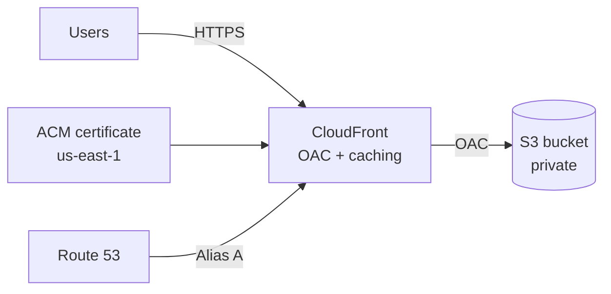

# 🛡️ AWS Secure Static Website (Terraform)


Secure-by-default AWS hosting for a **static site build** (React/Vite/Next export, etc.) delivered via **CloudFront + private S3**, with **DNS in Route 53** and **TLS from ACM (us-east-1)**.

This repo stays small and auditable. It ships an **evidence pack (screenshots)** that demonstrates identity, permissions, Terraform idempotency, audit logging (CloudTrail), and the deployed AWS resources.

> React note: After `npm run build`, a React app is just static assets (HTML/CSS/JS). This setup hosts those build artifacts—no server-side runtime needed.

---

## 🎯 What this project demonstrates

### ☁️ Cloud fundamentals
- CloudFront + S3 + Route 53 + ACM working together
- Remote Terraform state in S3 (optional DynamoDB locking)
- Reusable module with parameterized inputs (domain, bucket, optional WAF, optional ACM DNS validation)

### 🔐 Security mindset
- Private S3 origin (no public website hosting)
- CloudFront Origin Access Control (OAC): CloudFront is the only reader
- HTTPS-only with a modern TLS policy
- Least-privilege Terraform access via IAM Identity Center (SSO), not broad admin
- Auditability via CloudTrail (evidence included)

---

## 🧱 Architecture



Key idea: S3 stays private; CloudFront is the front door.

---

## 🗂️ Repository structure
```
├── .github/
│   └── workflows/
│       └── terraform-ci.yml        # CI: fmt/init/validate (lightweight)
├── infra/
│   ├── modules/
│   │   └── static_site/            # Reusable module (S3, CloudFront, ACM, Route 53)
│   ├── envs/
│   │   └── prod/                   # Example environment + remote backend config
│   └── docs/
│       └── evidence/               # Evidence screenshots (redact before sharing)
└── README.md
```

---

## ✅ Prerequisites
- Terraform `>= 1.6`
- AWS provider `>= 5.x`
- Existing Route 53 hosted zone for your domain
- Remote backend bucket for Terraform state (optional DynamoDB lock table)
- AWS credentials configured locally (recommended: AWS SSO / IAM Identity Center)

---

## ⚙️ Configuration
Defaults live in `infra/envs/prod/variables.tf` (override via `-var` or `*.tfvars`):

| Variable              | Description                            | Default           | Example        |
| --------------------- | -------------------------------------- | ----------------- | -------------- |
| `domain_name`         | Website domain                         | `canyildiz.de`    | `example.com`  |
| `hosted_zone_name`    | Route 53 hosted zone                   | `canyildiz.de`    | `example.com`  |
| `bucket_name`         | S3 bucket for static assets            | `canyildiz.de`    | `example.com`  |
| `enable_acm_validation` | Auto-create DNS validation records   | `false`           | `true`         |
| `web_acl_id`          | Optional WAFv2 WebACL ARN (CLOUDFRONT) | `null`            | `arn:aws:wafv2:...` |

### 🔎 ACM DNS validation (optional)
If `enable_acm_validation = true`, Terraform creates the required DNS validation records in Route 53 and runs certificate validation automatically.

### 🧱 WAF (optional)
If you attach a WAF, `web_acl_id` must be a WAFv2 WebACL ARN with Scope `CLOUDFRONT` (commonly created/managed in `us-east-1`).

---

## 🚀 Deploy (prod example)

### Windows / PowerShell (with AWS SSO)
```powershell
aws sso login --profile <your-sso-profile>
$env:AWS_PROFILE = "<your-sso-profile>"
$env:AWS_SDK_LOAD_CONFIG = "1"

cd infra/envs/prod
terraform init
terraform plan -out plan.out
terraform apply plan.out
```

### Linux/macOS / Bash (with AWS SSO)
```bash
aws sso login --profile <your-sso-profile>
export AWS_PROFILE="<your-sso-profile>"
cd infra/envs/prod
terraform init
terraform plan -out plan.out
terraform apply plan.out
```

After apply, outputs typically include:
- `cloudfront_domain`: CloudFront distribution domain
- `bucket_name`: S3 bucket for site assets

---

## 📦 Upload website content (React build example)
```bash
npm run build
aws s3 sync ./build s3://<your-bucket-name>/ --delete
```

Optional caching pattern:
```bash
# Long cache for hashed assets (adjust paths as needed)
aws s3 sync ./build s3://<your-bucket-name>/ --delete \
  --exclude "index.html" \
  --cache-control "public,max-age=31536000,immutable"

# Short cache for HTML
aws s3 cp ./build/index.html s3://<your-bucket-name>/index.html \
  --cache-control "public,max-age=60"
```

CloudFront invalidation (if required):
```bash
aws cloudfront create-invalidation --distribution-id <dist-id> --paths "/*"
```

---

## 🧠 Security decisions

| Decision                        | Rationale                                                      |
| --------------------------------| -------------------------------------------------------------- |
| Private S3 + CloudFront OAC     | Only CloudFront can read; no public S3 access                  |
| HTTPS-only & modern TLS         | Enforces encrypted transport; reduces downgrade risk           |
| Least-privilege Terraform role  | Uses scoped SSO role instead of broad admin                    |
| Evidence over claims            | Screenshots prove identity, policy scope, audit logs, resources |

---

## 🧾 Evidence pack (screenshots)
All images live in `infra/docs/evidence/`.

Security notice: Before sharing publicly, redact AWS account IDs, hosted zone IDs, email addresses, source IPs, access key IDs, request/event IDs.

### Evidence index
| #  | File                                      | What it proves                                                |
| -- | ----------------------------------------- | ------------------------------------------------------------- |
| 1  | `01-cli-sts-terraformdeployer.png`        | CLI session uses TerraformDeployer assumed role (SSO)         |
| 2  | `01-identity-center-assignments.png`      | IAM Identity Center assignments / permission sets             |
| 3  | `02a-terraformdeployer-general.png`       | TerraformDeployer permission set (overview)                   |
| 4  | `02b-terraformdeployer-inline-policy.png` | Inline policy shows scoped permissions                        |
| 5  | `02-terraform-plan-no-changes.png`        | Terraform plan shows no drift (idempotent)                    |
| 6  | `03-cloudtrail-assumerole.png`            | CloudTrail logs SSO federation / AssumeRoleWithSAML           |
| 7  | `04-cloudtrail-terraform-action.png`      | CloudTrail logs Terraform-triggered API activity              |
| 8  | `05a-s3-buckets.png`                      | S3 buckets exist (site bucket + tfstate bucket)               |
| 9  | `05b-cloudfront-distribution.png`         | CloudFront distribution deployed and serving                  |
| 10 | `05c-acm-certificate-issued.png`          | ACM certificate issued in us-east-1 for TLS                   |
| 11 | `05d-route53-hosted-zone.png`             | Route 53 records point to CloudFront                          |

---

## 🤖 CI (GitHub Actions)
`terraform-ci.yml` runs on push/PR to `main`/`master`:
- `terraform fmt -check -recursive`
- `terraform init -backend=false` (no remote state touched)
- `terraform validate`

---

## 🛠️ Roadmap / next improvements
- Add CloudFront/S3 access logging and query via Athena
- Add AWS WAF baseline rules (rate limiting + managed rules)
- Add cost guardrails (Budgets + alarms)
- Add security scanning (tflint, tfsec, checkov)
- Add `terraform.tfvars.example` for quick onboarding
