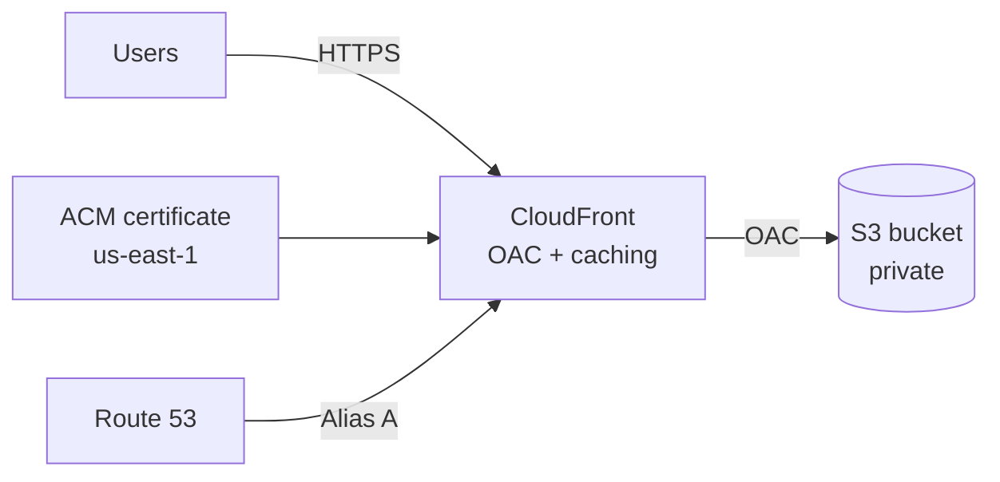

# AWS Secure Static Website (Terraform)


Secure AWS hosting for static build artifacts (React, Vite, Next.js export, etc.) using CloudFront with a private S3 origin. DNS is managed in Route 53, TLS comes from ACM (us-east-1). An evidence pack of screenshots shows the setup end to end: identity, permissions, Terraform idempotency, audit logging, and deployed resources.

---

## What this covers
- Platform: CloudFront + S3 + Route 53 + ACM wired together; remote Terraform state in S3 (optional DynamoDB lock); reusable module with variable inputs.
- Security: S3 stays private (no public website hosting). CloudFront is the only reader via Origin Access Control (OAC). HTTPS-only with a modern TLS policy. Terraform runs under a dedicated SSO role with scoped permissions. All activity is logged in CloudTrail.

---

## Architecture

Key point: S3 is completely private. CloudFront is the only reader; users hit CloudFront over HTTPS.

---

## Repo structure
```
.github/workflows/terraform-ci.yml   # CI: fmt, init, validate
infra/
  modules/static_site/               # Reusable Terraform module
  envs/prod/                         # Prod environment + backend config
  docs/evidence/                     # Screenshots
README.md
```

---

## Prerequisites
- Terraform >= 1.6, AWS provider >= 5.x
- Route 53 hosted zone for your domain
- S3 bucket for Terraform state (DynamoDB lock table optional)
- AWS credentials locally (SSO/Identity Center recommended)

---

## Configuration
Defaults live in `infra/envs/prod/variables.tf`. Override with `-var` or a `*.tfvars` file:

| Variable              | What it does                          | Example           |
| --------------------- | ------------------------------------- | ----------------- |
| `domain_name`         | Website domain                        | `example.com`     |
| `hosted_zone_name`    | Route 53 hosted zone                  | `example.com`     |
| `bucket_name`         | S3 bucket for static files            | `example.com`     |
| `enable_acm_validation` | Create DNS validation records for ACM | `true`            |
| `web_acl_id`          | Optional WAFv2 WebACL ARN             | `arn:aws:wafv2:...` |

If `enable_acm_validation = true`, Terraform handles certificate validation by creating the Route 53 records. For WAF, the WebACL must be scoped to CLOUDFRONT and created in us-east-1.

---

## Deploy

PowerShell (Windows):
```powershell
aws sso login --profile <profile>
$env:AWS_PROFILE = "<profile>"
$env:AWS_SDK_LOAD_CONFIG = "1"

cd infra/envs/prod
terraform init
terraform plan -out plan.out
terraform apply plan.out
```

Bash (Linux/macOS):
```bash
aws sso login --profile <profile>
export AWS_PROFILE="<profile>"

cd infra/envs/prod
terraform init
terraform plan -out plan.out
terraform apply plan.out
```

After apply you get `cloudfront_domain` (CloudFront URL) and `bucket_name` (upload target).

---

## Upload your site

Basic:
```bash
npm run build
aws s3 sync ./build s3://<bucket>/ --delete
```

With caching (recommended):
```bash
# Cache assets long
aws s3 sync ./build s3://<bucket>/ --delete \
  --exclude "index.html" \
  --cache-control "public,max-age=31536000,immutable"

# Cache HTML short
aws s3 cp ./build/index.html s3://<bucket>/index.html \
  --cache-control "public,max-age=60"
```

If you need immediate changes:
```bash
aws cloudfront create-invalidation --distribution-id <id> --paths "/*"
```

---

## Security summary
| What               | How                                                         |
| ------------------ | ----------------------------------------------------------- |
| S3 access          | Private bucket; CloudFront reads via OAC                   |
| Transport          | HTTPS-only, modern TLS                                     |
| Terraform perms    | Scoped SSO role, no admin access                           |
| Audit              | CloudTrail logs all API activity                           |

---

## Evidence
Screenshots are in `infra/docs/evidence/` and follow the chain: identity → permissions → Terraform → audit trail → deployed resources. Redact account IDs, hosted zone IDs, emails, IPs before sharing.

- CLI identity: `aws sts get-caller-identity` shows the TerraformDeployer SSO role (short-lived, scoped).  
  

- IAM Identity Center assignments: account assignments and permission sets (TerraformDeployer, WebsiteDeployer, AdministratorAccess); shows SSO model and role separation.  
  

- TerraformDeployer permission set: configuration and session duration; managed, reusable deploy role.  
  

- TerraformDeployer inline policy: scoped JSON permissions for S3 (state + site), DynamoDB (lock), Route 53, CloudFront, ACM.  
  

- Terraform plan: ends with “No changes. Your infrastructure matches the configuration.”  
  

- CloudTrail SSO session: AssumeRoleWithSAML event with timestamp and role ARN; sessions are logged.  
  

- CloudTrail Terraform activity: CloudFront API calls from Terraform are visible and traceable.  
  

- S3 buckets: separate website bucket and tfstate bucket (regions, timestamps).  
  

- CloudFront distribution: enabled/deployed, custom domains, private S3 origin.  
  

- ACM certificate: issued in us-east-1 for root + www; CloudFront-compatible.  
  

- Route 53 records: A/AAAA alias records for root and www pointing to CloudFront.  
  

---

## CI
Workflow `.github/workflows/terraform-ci.yml` runs on every push/PR:
- `terraform fmt -check -recursive`
- `terraform init -backend=false`
- `terraform validate`

---

## Roadmap
- CloudFront/S3 access logging + Athena queries
- WAF baseline rules (rate limiting, managed rules)
- Budget alerts
- Security scanning in CI (tflint, tfsec, checkov)
- `terraform.tfvars.example` for easier onboarding
