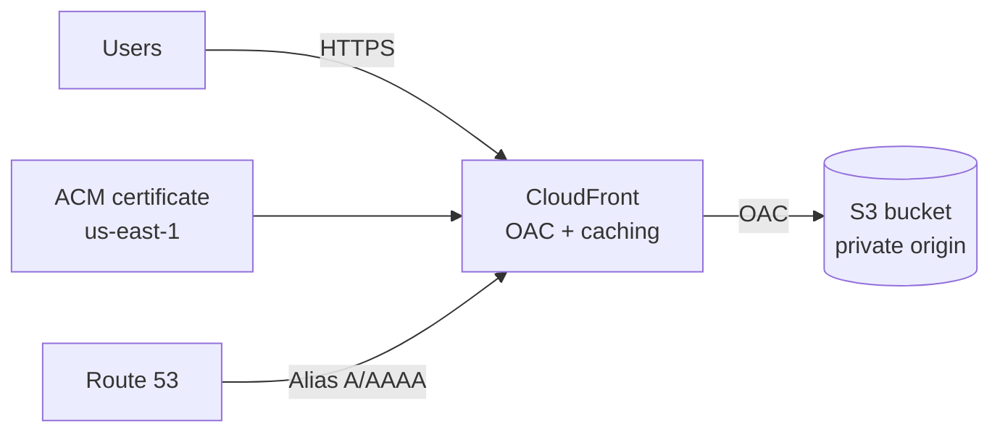

# AWS Secure Static Website (Terraform)


Secure-by-default hosting for static site build output (React/Vite/Next.js export/Hugo/plain HTML) on AWS: CloudFront (CDN + TLS) -> private S3 (origin), Route 53 (DNS), ACM (certificate in us-east-1). This repo is intentionally small and auditable. It includes an evidence pack (screenshots) that proves identity, permissions, Terraform results, audit logs, and deployed resources.

---

## ⚡ Proof in 30 seconds

- Identity: `aws sts get-caller-identity` shows the CLI is using a dedicated TerraformDeployer SSO role -> `infra/docs/evidence/01-cli-sts-terraformdeployer.png`
- Idempotency / drift: `terraform plan` shows `No changes` -> `infra/docs/evidence/02-terraform-plan-no-changes.png`
- Auditability: CloudTrail shows SSO role assumption and API activity tied to that role session -> `infra/docs/evidence/03-cloudtrail-assumerole.png`, `infra/docs/evidence/04-cloudtrail-terraform-action.png`

---

## 📚 Table of contents

- [What this project demonstrates](#what-this-project-demonstrates)
- [Architecture](#architecture)
- [Prerequisites](#prerequisites)
- [Configuration](#configuration)
- [ACM DNS validation (optional)](#acm-dns-validation-optional)
- [WAF (optional)](#waf-optional)
- [Deploy](#deploy)
- [Upload your site](#upload-your-site)
- [Single-page apps (SPA)](#single-page-apps-spa)
- [Evidence pack (screenshots)](#evidence-pack-screenshots)
- [CI](#ci)
- [Roadmap](#roadmap)

---

## 🎯 What this project demonstrates

### Cloud fundamentals (end-to-end)
- CloudFront + S3 + Route 53 + ACM wired together
- Remote Terraform state in S3 (optional DynamoDB lock table)
- A reusable module with parameters for domain/zone/bucket (plus optional WAF and ACM DNS validation)

### Security mindset (practical)
- Private S3 origin (no public bucket access)
- CloudFront Origin Access Control (OAC) so CloudFront is the only allowed reader
- HTTPS-only delivery with a modern TLS policy
- Least-privilege deployments via IAM Identity Center (SSO), not permanent IAM users
- Evidence over claims: screenshots show what was built and how it is controlled

> React note: a React site becomes static after `npm run build`. This Terraform stack hosts the build artifacts (HTML/CSS/JS) securely; it does not run a Node.js server.

---

## 📐 Architecture



Key idea: S3 stays private; CloudFront is the only public entry point.

### Repository structure

```
.github/workflows/terraform-ci.yml   # CI: fmt, init (no backend), validate
infra/
  modules/static_site/               # Reusable Terraform module
  modules/waf_baseline/              # Optional CloudFront-scoped WAF baseline
  envs/prod/                         # Example environment + remote backend
  docs/evidence/                     # Screenshot evidence pack
  docs/architecture/                 # Place exported PNG/SVG architecture diagrams here
README.md
```

---

## ✅ Prerequisites

- Terraform >= 1.6
- AWS Provider >= 5.x
- A registered domain with an existing Route 53 hosted zone
- A dedicated S3 bucket for Terraform remote state (and optional DynamoDB lock table)
- AWS credentials configured locally (recommended: AWS SSO / IAM Identity Center)
- Why ACM in `us-east-1`? CloudFront requires ACM certificates to be in `us-east-1`, so this repo uses a second provider alias (`aws.use1`) for ACM (and WAF).

---

## ⚙️ Configuration

Defaults live in `infra/envs/prod/variables.tf` (override via `terraform.tfvars` or `-var`).

| Variable                | Description                             | Example             |
| ----------------------- | --------------------------------------- | ------------------- |
| `domain_name`           | Website domain                          | `example.com`       |
| `hosted_zone_name`      | Route 53 hosted zone                    | `example.com`       |
| `bucket_name`           | S3 bucket for site assets               | `example.com`       |
| `enable_acm_validation` | Auto-create DNS validation records      | `true`              |
| `web_acl_id`            | Optional WAFv2 WebACL ARN               | `null`              |

Docs automation: run `terraform-docs` against `infra/envs/prod` if you want generated inputs/outputs tables.

`infra/envs/prod/terraform.tfvars.example` shows the expected inputs with placeholders.

---

## 🔐 ACM DNS validation (optional)

If `enable_acm_validation = true`, Terraform creates the required DNS validation records in Route 53 and performs certificate validation automatically.

---

## 🛡️ WAF (optional)

If you attach a WAF, `web_acl_id` must be a WAFv2 WebACL ARN with `scope = CLOUDFRONT` (managed in `us-east-1`). A minimal baseline module is provided in `infra/modules/waf_baseline/`; pass its ARN into `web_acl_id` when you want it enforced.

---

## 🚀 Deploy

PowerShell (Windows + AWS SSO):

```powershell
aws sso login --profile <profile>

$env:AWS_PROFILE = "<profile>"
$env:AWS_SDK_LOAD_CONFIG = "1"

cd infra/envs/prod
terraform init
terraform plan -out plan.out
terraform apply plan.out
```

Bash (Linux/macOS + AWS SSO):

```bash
aws sso login --profile <profile>
export AWS_PROFILE="<profile>"

cd infra/envs/prod
terraform init
terraform plan -out plan.out
terraform apply plan.out
```

Typical outputs after apply:

- `cloudfront_domain` - CloudFront distribution domain
- `bucket_name` - S3 bucket for site content

---

## 📦 Upload your site

Basic:

```bash
npm run build
aws s3 sync ./build s3://<your-bucket>/ --delete
```

Better caching (assets long-lived, HTML short-lived):

```bash
aws s3 sync ./build s3://<your-bucket>/ --delete \
  --exclude "index.html" \
  --cache-control "public,max-age=31536000,immutable"

aws s3 cp ./build/index.html s3://<your-bucket>/index.html \
  --cache-control "public,max-age=60"
```

Optional invalidation:

```bash
aws cloudfront create-invalidation --distribution-id <dist-id> --paths "/*"
```

---

## 🧩 Single-page apps (SPA)

CloudFront is configured to map 403/404 to `/index.html`, so deep links still work on refresh.

---

## 🧾 Evidence pack (screenshots)

All evidence images live in `infra/docs/evidence/`.

> Security notice (before sharing publicly): redact account IDs, hosted zone IDs, email addresses, source IPs, request IDs, access key IDs, and any session tokens.

The evidence follows the flow: Identity -> Access model -> Permissions -> Terraform result -> Audit logs -> Resources.

1) CLI identity (who is Terraform acting as?)  
   File: `infra/docs/evidence/01-cli-sts-terraformdeployer.png`  
   Shows `aws sts get-caller-identity` confirming the CLI session is an assumed SSO role (TerraformDeployer). This proves deployments are performed with short-lived federated credentials (SSO), not permanent IAM keys, and not admin by default.
   

2) IAM Identity Center assignments (how access is granted)  
   File: `infra/docs/evidence/01-identity-center-assignments.png`  
   Shows the AWS account assignment and which permission sets are granted to the user. This documents a clean SSO access model with separation of duties (infra deploy vs. content upload vs. admin-only tasks).
   

3) TerraformDeployer permission set (session governance)  
   File: `infra/docs/evidence/02a-terraformdeployer-general.png`  
   Shows TerraformDeployer permission set configuration (for example, session duration). This demonstrates the role is centrally managed and designed for controlled infrastructure work.
    

4) TerraformDeployer inline policy (least privilege proof)  
   File: `infra/docs/evidence/02b-terraformdeployer-inline-policy.png`  
   Shows the actual policy statements attached to TerraformDeployer. Look for scope-limited access to the state bucket, lock table, Route 53, CloudFront, and ACM - permissions tailored to this stack.
    

5) Terraform plan (idempotency / drift check)  
   File: `infra/docs/evidence/02-terraform-plan-no-changes.png`  
   Shows `terraform plan` reporting `No changes`. This proves the deployed infrastructure matches the Terraform configuration and reduces configuration drift risk.
   

6) CloudTrail SSO role assumption (audit trail)  
   File: `infra/docs/evidence/03-cloudtrail-assumerole.png`  
   Shows a CloudTrail event for `AssumeRoleWithSAML`, proving the session was established via SSO federation. This is important because it is a verifiable audit record: who assumed what role, when, and from where.
   

7) CloudTrail Terraform activity (changes are traceable)  
   File: `infra/docs/evidence/04-cloudtrail-terraform-action.png`  
   Shows CloudTrail logging API calls (for example, CloudFront/S3/Route 53 reads/writes) tied to the TerraformDeployer session. This proves infrastructure operations are logged and attributable.
   

8) S3 buckets (state + content separation)  
   File: `infra/docs/evidence/05a-s3-buckets.png`  
   Shows the content bucket and the Terraform state bucket as separate resources. This separation supports cleaner lifecycle management and reduces the blast radius for mistakes.
   

9) CloudFront distribution (secure delivery front door)  
   File: `infra/docs/evidence/05b-cloudfront-distribution.png`  
   Shows the CloudFront distribution is deployed and configured with custom domain aliases and an S3 origin. This is the front door that enforces HTTPS and uses OAC to keep S3 private.
   

10) ACM certificate (TLS proof)  
    File: `infra/docs/evidence/05c-acm-certificate-issued.png`  
    Shows the ACM certificate in `us-east-1` with status `Issued` and domain coverage (root + www). This proves the TLS chain is properly set up for CloudFront.
    

11) Route 53 hosted zone + records (DNS chain proof)  
    File: `infra/docs/evidence/05d-route53-hosted-zone.png`  
    Shows Route 53 records (A/AAAA alias) pointing the domain to CloudFront. This completes the chain: Domain -> Route 53 -> CloudFront -> private S3.
    

---

## ✅ CI

The workflow `.github/workflows/terraform-ci.yml` runs on push/PR:

- `terraform fmt -check -recursive`
- `terraform init -backend=false`
- `terraform validate`

No AWS credentials required - this is a lightweight quality gate to catch syntax and formatting issues early.

---

## 🧭 Roadmap

- Enable CloudFront + S3 access logging and query via Athena
- Add cost guardrails (Budgets + alarms)
- Add security scanning in CI (tflint, tfsec, checkov)
- Optional baseline WAF rules (rate limiting + AWS managed rules)
- Add terraform-docs generated inputs/outputs tables
