# AWS Secure Static Website (Terraform)


Secure AWS hosting for static build artifacts (React/Vite/Next export, etc.) delivered via CloudFront and a private S3 origin, with DNS in Route 53 and TLS from ACM (us-east-1). The repository includes an evidence pack (screenshots) demonstrating identity, permissions, Terraform idempotency, audit logging, and deployed resources.

---

## Scope and Capabilities
- CloudFront + S3 + Route 53 + ACM working together
- Remote Terraform state in S3 (optional DynamoDB locking)
- Reusable module with parameterized inputs (domain, bucket, optional WAF, optional ACM DNS validation)
- Private S3 origin, CloudFront Origin Access Control (OAC), HTTPS-only, and least-privilege Terraform access via IAM Identity Center (SSO)
- Auditability through CloudTrail (evidence provided)

---

## Architecture
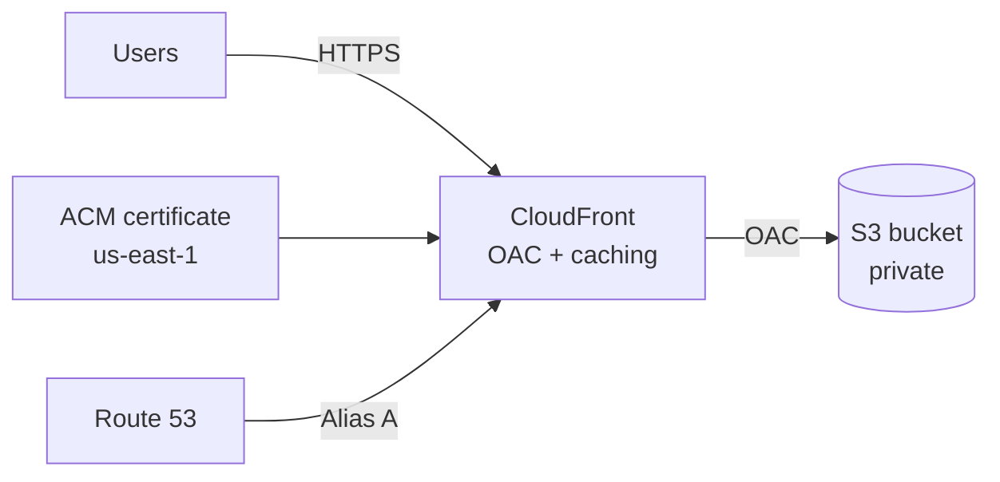
S3 remains private; CloudFront is the only reader.

---

## Repository Structure
```
.github/workflows/terraform-ci.yml   # CI: fmt/init/validate
infra/
  modules/static_site/               # Module: S3, CloudFront, ACM, Route 53
  envs/prod/                         # Example environment + remote backend config
  docs/evidence/                     # Evidence screenshots (redact before sharing)
README.md
```

---

## Prerequisites
- Terraform >= 1.6
- AWS provider >= 5.x
- Existing Route 53 hosted zone for your domain
- Remote backend bucket for Terraform state (optional DynamoDB lock table)
- AWS credentials configured locally (recommended: AWS SSO / IAM Identity Center)

---

## Configuration
Defaults in `infra/envs/prod/variables.tf` (override via `-var` or `*.tfvars`):

| Variable                | Description                              | Default        | Example        |
| ----------------------- | ---------------------------------------- | -------------- | -------------- |
| domain_name             | Website domain                           | canyildiz.de   | example.com    |
| hosted_zone_name        | Route 53 hosted zone                     | canyildiz.de   | example.com    |
| bucket_name             | S3 bucket for static assets              | canyildiz.de   | example.com    |
| enable_acm_validation   | Auto-create DNS validation records       | false          | true           |
| web_acl_id              | Optional WAFv2 WebACL ARN (CLOUDFRONT)   | null           | arn:aws:wafv2:... |

ACM validation: if `enable_acm_validation = true`, Terraform creates DNS validation records in Route 53 and runs certificate validation.
WAF: `web_acl_id` must be a WAFv2 WebACL ARN with Scope CLOUDFRONT (commonly in us-east-1).

---

## Deployment (prod example)

Windows / PowerShell (AWS SSO):
```powershell
aws sso login --profile <your-sso-profile>
$env:AWS_PROFILE = "<your-sso-profile>"
$env:AWS_SDK_LOAD_CONFIG = "1"
cd infra/envs/prod
terraform init
terraform plan -out plan.out
terraform apply plan.out
```

Linux/macOS / Bash (AWS SSO):
```bash
aws sso login --profile <your-sso-profile>
export AWS_PROFILE="<your-sso-profile>"
cd infra/envs/prod
terraform init
terraform plan -out plan.out
terraform apply plan.out
```

Outputs typically include:
- cloudfront_domain: CloudFront distribution domain
- bucket_name: S3 bucket for site assets

---

## Upload Static Content (example)
```bash
npm run build
aws s3 sync ./build s3://<your-bucket-name>/ --delete
```
Optional caching pattern:
```bash
aws s3 sync ./build s3://<your-bucket-name>/ --delete \
  --exclude "index.html" \
  --cache-control "public,max-age=31536000,immutable"
aws s3 cp ./build/index.html s3://<your-bucket-name>/index.html \
  --cache-control "public,max-age=60"
```
CloudFront invalidation if required:
```bash
aws cloudfront create-invalidation --distribution-id <dist-id> --paths "/*"
```

---

## Security Decisions

| Decision                        | Rationale                                                      |
| --------------------------------| -------------------------------------------------------------- |
| Private S3 + CloudFront OAC     | Only CloudFront can read; no public S3 access                  |
| HTTPS-only & modern TLS         | Enforces encrypted transport; reduces downgrade risk           |
| Least-privilege Terraform role  | Uses scoped SSO role instead of broad admin                    |
| Evidence over claims            | Screenshots for identity, policy scope, audit logs, resources  |

---

## Evidence Pack
Screenshots live in `infra/docs/evidence/`. Redact account IDs, hosted zone IDs, email addresses, source IPs, access key IDs, and request/event IDs before sharing.

1) CLI identity (SSO role confirmation)  
Shows `aws sts get-caller-identity` with an assumed-role ARN for the TerraformDeployer SSO role. Proves commands run under short-lived, scoped credentials.  
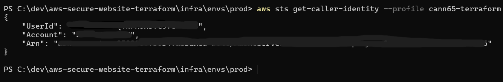

2) IAM Identity Center assignments  
Account assignments and permission sets (TerraformDeployer, WebsiteDeployer, AdministratorAccess). Demonstrates SSO-based access and separation of duties.  
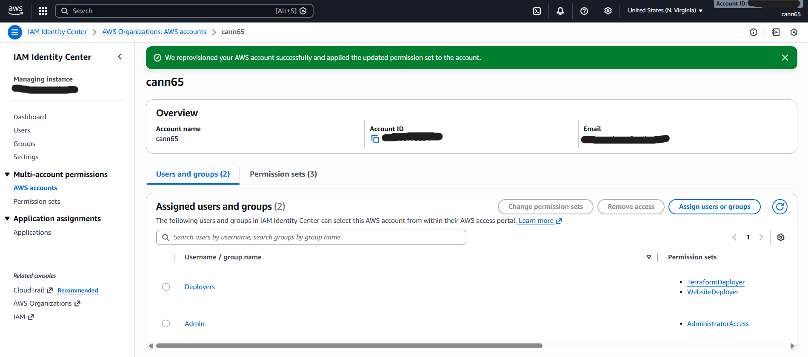

3) TerraformDeployer permission set (overview)  
Session duration and provisioning status for the deploy role. Confirms the role is managed as a scoped permission set.  
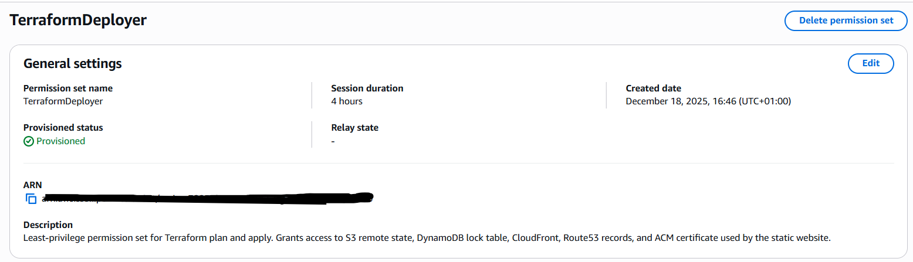

4) TerraformDeployer inline policy (least privilege)  
Inline JSON policy with targeted permissions for S3 (state + site), DynamoDB (lock), Route 53, CloudFront, and ACM. Evidence of scoped access.  
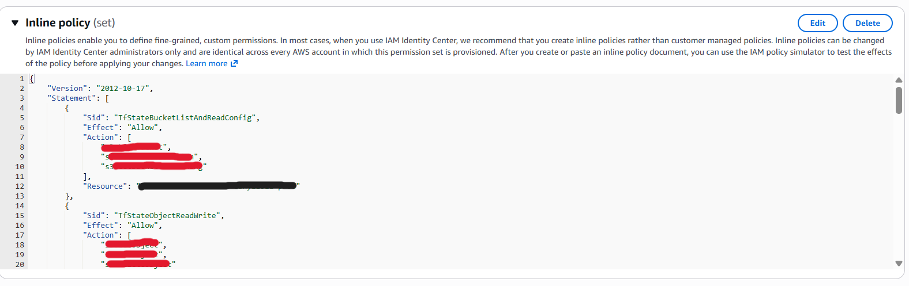

5) Terraform plan (no changes)  
Terraform output ending with “No changes. Your infrastructure matches the configuration.” Confirms idempotency and no drift.  
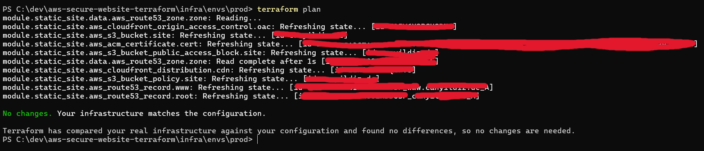

6) CloudTrail federation event (AssumeRoleWithSAML)  
CloudTrail entry for the SSO session creation, with timestamp and role ARN. Proves sessions are logged and traceable.  
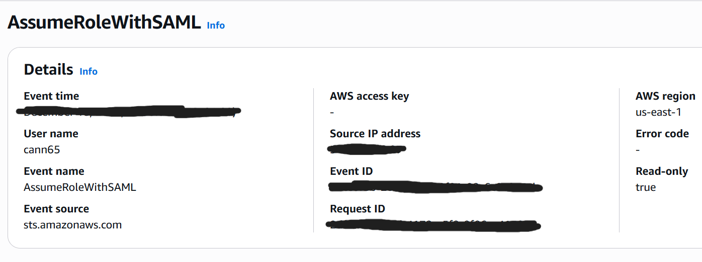

7) CloudTrail API activity (Terraform)  
CloudTrail events for Terraform-driven API calls (e.g., CloudFront). Shows infra actions are auditable.  
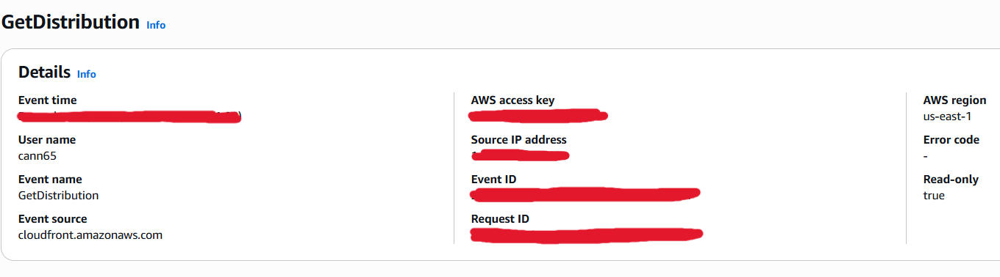

8) S3 buckets (content + state)  
Bucket list including the website bucket and the Terraform state bucket, with regions and timestamps. Separates app content from state storage.  
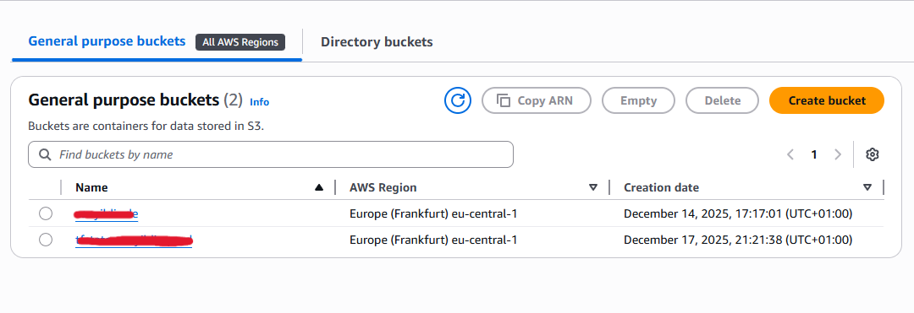

9) CloudFront distribution  
Distribution entry with custom domains and S3 origin, status enabled/deployed. Confirms CDN front door is active.  
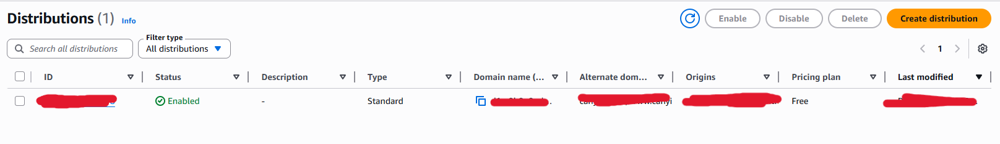

10) ACM certificate (us-east-1 for CloudFront)  
Certificate status: Issued; covers root + www; in us-east-1. Matches CloudFront requirements.  
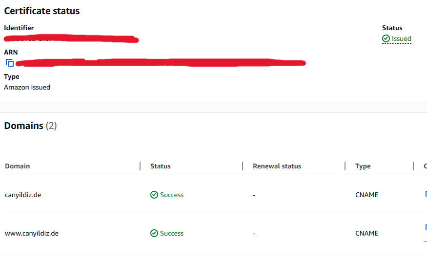

11) Route 53 alias records to CloudFront  
A/AAAA alias records for root and www pointing to the CloudFront distribution. Completes DNS -> CDN -> S3 chain.  
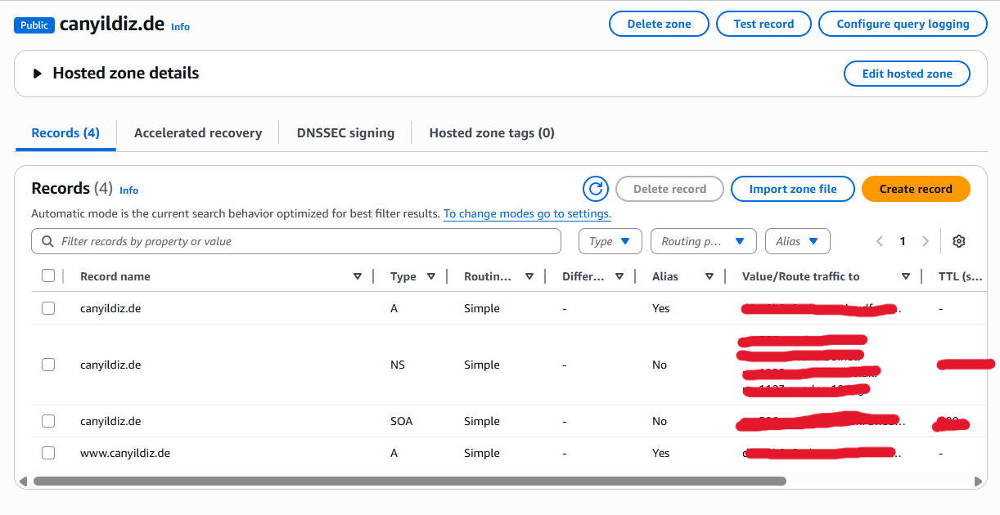

---

## Continuous Integration
Workflow: `.github/workflows/terraform-ci.yml` (runs on push/PR to main/master)
- terraform fmt -check -recursive
- terraform init -backend=false
- terraform validate

---

## Roadmap
- Add CloudFront/S3 access logging and query via Athena
- Add AWS WAF baseline rules (rate limiting + managed rules)
- Add cost guardrails (Budgets + alarms)
- Add security scanning (tflint, tfsec, checkov)
- Add terraform.tfvars.example for quicker onboarding
